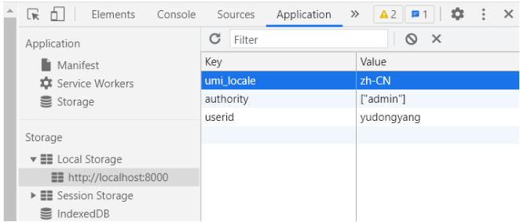
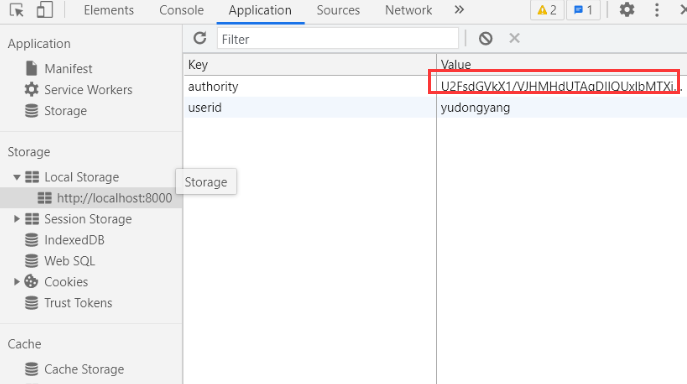

# Blockchain Notes
> Used to record the process of learning blockchain. (Node+Egg.js+fabric)

跳转最近[更新](#最新)

# 2020

## 10.17-10.23

* 阅读《区块链技术进阶与实战》关于Hyperledger Fabric部分
* 成功搭建fabric v1.0环境
* 系统学习VueJs框架，即将转向EggJs

下周目标：

* 阅读论文[When Mobile Blockchain Meets Edge Computing_IEEE Communication Magazine2018](./Blockchain-Article)

* 尽快学完Vuejs，以及尽快掌握Hyperledger特性，架构等。

## 10.24-10.30

用于开始毕业实习，可能时间需要均匀分配。

* 完成论文[When Mobile Blockchain Meets Edge Computing_IEEE Communication Magazine2018](./Blockchain-Article)阅读以及[笔记记录](https://github.com/Dongyang-Yu/BlockchainNotes/blob/main/%E8%AE%BA%E6%96%87%E9%98%85%E8%AF%BB/When%20Mobile%20Blockchain%20Meets%20Edge%20Computing.md)
* Vue Router部分以及脚手架的学习

下周目标：

* 阅读共识算法PoW[Bitcoin: A Peer-to-Peer Electronic Cash System](./Blockchain-Article)

## 10.31-11.6

* 完成论文[Blockchain framework for IoT data quality via edge computing](./Blockchain-Article)阅读以及[笔记](https://github.com/Dongyang-Yu/BlockchainNotes/blob/main/%E8%AE%BA%E6%96%87%E9%98%85%E8%AF%BB/Blockchain%20framework%20for%20IoT%20data%20quality%20via%20edge%20computing.md)
* Vue Promise，Vuex及网络模块封装学习。

下周目标：

* 利用VueJs搭建项目。
* 阅读共识算法PoW

## 11.7-11.13

* 完成比特币白皮书《[Bitcoin A Peer-to-Peer Electronic Cash System](./Blockchain-Article)》阅读（包含PoW共识算法）以及[笔记](https://github.com/Dongyang-Yu/BlockchainNotes/blob/main/%E8%AE%BA%E6%96%87%E7%AC%94%E8%AE%B0/Bitcoin%20A%20Peer-to-Peer%20Electronic%20Cash%20System.md)
* [VueJs项目](https://github.com/Dongyang-Yu/Vue-mall)搭建进行中

下周目标：

* 阅读论文《[PolyShard-Coded Sharding Achieves Linearly Scaling Efficiency and Security Simultaneously](./Blockchain-Article)》
* 继续搭建Vue项目

## 11.14-11.20

* 完成PBFT《[Practical Byzantine Fault Tolerance]()》论文阅读以及[笔记](https://github.com/Dongyang-Yu/BlockchainNotes/blob/main/%E8%AE%BA%E6%96%87%E7%AC%94%E8%AE%B0/Practical%20Byzantine%20Fault%20Tolerance.md)记录
* VueJs项目搭建进行中

下周目标：

* 阅读论文《[PolyShard-Coded Sharding Achieves Linearly Scaling Efficiency and Security Simultaneously](./Blockchain-Article)》
* 继续搭建VueJs项目
* 搜集资料，决定毕业设计内容

## 11.21-11.27

* 阅读溯源系统文章《[A Scheme about Agricultural Produce Traceability using Blockchain based on Hyperledger Fabric](./Blockchain-Article)》以及[笔记](https://github.com/Dongyang-Yu/BlockchainNotes/blob/main/%E8%AE%BA%E6%96%87%E7%AC%94%E8%AE%B0/A%20Scheme%20about%20Agricultural%20Produce%20Traceability%20using%20Blockchain%20based%20on%20Hyperledger%20Fabric.md)的记录。
* [VueJs项目](https://github.com/Dongyang-Yu/Vue-mall)搭建，网络商城即将搭建完成。

下周目标：

* 搜集毕设资料
* 完成VueJs项目的搭建

## 11.28-12.4

* 重新阅读比特币白皮书《[Bitcoin A Peer-to-Peer Electronic Cash System](./Blockchain-Article)》，进行PPT呈现并讲解。
* [VueJs项目](https://github.com/Dongyang-Yu/Vue-mall)搭建
* 学习Bootstrap前段框架，笔记记录

下周目标：

* 完成VueJs项目的搭建
* 搜集毕设资料

## 12.5-12.11

* VueJs项目基本搭建完成。
* Bootstrap基本掌握
* 毕业实习结束

下周目标：

* 弄懂比特币细节具体操作

## 12.12-12.18

* 深入理解比特币流程，如交易模型、交易如何打包入区块中、比特币系统是如何避免双重支付等等
* 制作比特币相关PPT展示
* 阅读PoC容量证明共识机制相关资料

下周目标：

* 搜集PoC资料，搞明白技术原理，制作PPT
* 搜集基于存储的共识（EPoSt）相关资料

## 12.19-12.25

* 了解PoC容量证明和PoSt时空证明共识机制
* 阅读FileCoin白皮书

## 12.26-2021.1.1

* 阅读《Coded Merkle Tree: Solving Data Availability Attacks in Blockchains》
  * 其引用论文《Fraud and Data Availability Proofs: Maximising Light Client Security and Scaling Blockchains with Dishonest Majorities》
    * Erasure Code纠删码
* 阅读《精通比特币》中比特币客户端的类型、源代码、模拟操作
  * 网络模型	
    * Full nodes全节点
    * light nodes轻节点
  * 交易脚本的代码具体实现

# 2021

## 1.2-1.8

无进度汇报

## 1.9-1.15

* 搭建Fabric v1.4.0项目
* 阅读Fabric官方文档，查看案例源码（fabcar, fabric-samples）进行代码学习

## 1.16-1.22

* 阅读Fabric文档、教程、网络架构
* 运行商业票据项目，阅读链码API并尝试编写代码

* 运行`oldchain`项目

* vagrant，docker指令学习，
* 分析配置文件
  * 证书配置文件`crypto-config.yaml`
  * 组织、通道配置文件`configtx.yaml`

> 笔记位置[Hyperledger Fabric学习笔记](https://github.com/dongyangyu1999/BlockchainNotes/tree/main/Hyperledger%20Fabric%E5%AD%A6%E4%B9%A0%E7%AC%94%E8%AE%B0)

## 1.23-1.29

* 分析配置文件
  * 排序节点配置文件`orderer.yaml`
  * peer节点配置文件`core.yaml`
* 创建、加入通道的指令学习
* 安装，实例化链码，以及链码调用实现
* 学习`docker-compose`在单机上部署多个容器
* 学习`Vagrantfile`配置文件

> 笔记位置[Hyperledger Fabric学习笔记](https://github.com/dongyangyu1999/BlockchainNotes/tree/main/Hyperledger%20Fabric%E5%AD%A6%E4%B9%A0%E7%AC%94%E8%AE%B0)

## 1.30-2.5

* `Vagrantfile`配置文件分析
* 利用vagrant和docker实现一键部署网络
* shell脚本学习与实现
* MSP目录学习

## 2.6-2.19

略

## 2.20-2.26

* 调试eggJS项目，进行配置

* 阿里云ECS服务器了解与配置
* redis服务器安装，部署前端代码

* 阅读《区块链原理、设计和应用》链码部分，学习链码及其API
* 学习eggJS框架，尝试写接口

下周目标

* 了解gRPC，通过Fabric-node-sdk学习如何通过节点的gRPC协议访问安装在peer节点上的链码

## 2.27-3.5

* 完成毕设开题报告

* 通过Fabric-node-sdk学习如何通过节点的gRPC协议访问安装在peer节点上的链码

## 3.6-3.12

* 完成链码部分设计和接口的设计

## 3.13-3.19

* 链码设计（苹果树，包裹的查询，修改）
* 接口设计（创建用户、发送包裹、获取苹果树信息、查询包裹信息、添加苹果树、添加包裹等）
* 学习React框架，学习dva应用流框架，调用后端接口。

下周目标：

* 继续学习React框架，学习如何写组件，以及对数据的渲染

## 3.20-3.26

* 实现前端获取后端数据，并完成初步的数据渲染
  * 学习了dva框架，主要用于获取远程接口数据，以及如何在页面上通过`this.props`的属性渲染数据
* 重新设计了接口，规范化方法名以及注释等，同时完成了API的接口文档
  * 通过EggJs框架实现了控制器、服务分离，便于阅读与调试

* 重新设计了链码（智能合约），将方法设计抽象化，增强可移植性
* 前端实现产品线以及包裹查询功能，初步UI渲染成功

下周目标：

* 完成用户权限管理模块的设计
* 开始交互模块：网页上添加、更新对象

## 3.27-4.2

* 完成用户登录模块
* 完成权限管理模块：动态路由、动态菜单（即特定权限的使用者只能访问页面，进行鉴权）
* 完成苹果树、苹果、包裹新建功能
* 完成用户管理页面（修改、删除用户信息）

下周目标：

* 升级区块链数据库为CouchDB（支持富查询）：暂时不需要
* * 管理员页面显示产品的批次信息（通过MySQL数据库实现）
* 增加二维码读取与生成功能

## 4.3-4.9

* 新建`firstLevel`和`secondLevel`mysql表，用于初步显示第一层级和第二层级数据，记录链上数据的基本信息，便于页面显示
* 实现二维码扫描功能
  * 提交二维码前校验二维码内容
* 将前端项目部署到eggJS项目中
  * 学习了静态资源注册的相关知识
  * 了解了哈希路由和浏览器路由两种方式及区别
* 完成网页端交互区块链功能
  * 添加数据上链
  * 更新数据上链

* 信息页展示数据的同步（第二层级数据展示时其所属第一层级的信息展示，原先为默认字符串展示）
* 前端页面布局优化

## 4.10-4.16

* 修复扫描二维码显示无效问题

* 合并`产品线查询`和`阶段查询`，根据编号前缀进行分类显示
  * 将输入或者通过二维码获得的ID进行区块链查询，有才显示，无就报错
* 完成二维码下载按钮
* 更新检索的校对规则（如数据未上链进行提示、检索编号若不正确则进行提示）

* 修改后端操作Fabric的源码，将上链的用户和组织进行修改（原先是设置为默认的`admin和org1`）
* 完善剩余组织(`org2, org3, org4`)的网关配置，即连接配置文件。（在`prodTrace-Backend/app/public/gateway`中）
* 修复页面刷新bug：层级数据具体操作页面刷新无法获取值

* 设计轮播式的溯源信息展示

* 优化溯源信息展示页面，更新网站名称和logo
* 优化表格组件，抽取为一个通用组件

## 4.17-4.23

* 修复权限的安全问题：
  * 之前是以明文显示，修复后通过AES加密方式进行暴露，通过自定义密钥进行解密获取原本权限值。

* 开始撰写毕业论文
  * 完成摘要、绪论
  * 第二章开头

# 最新

